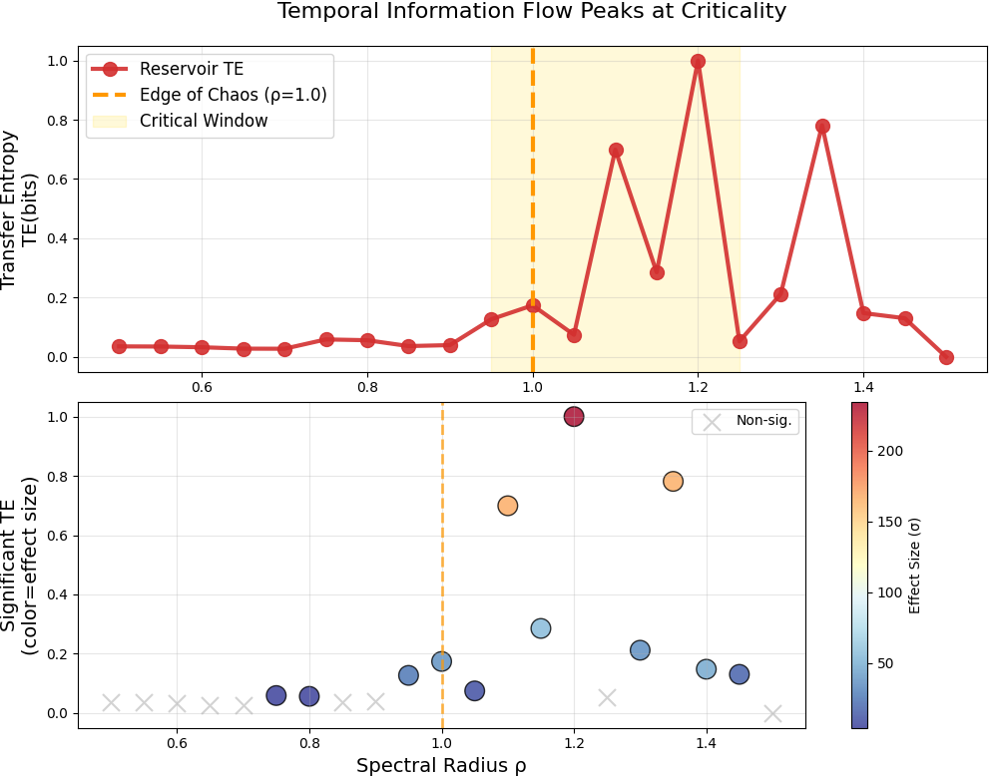
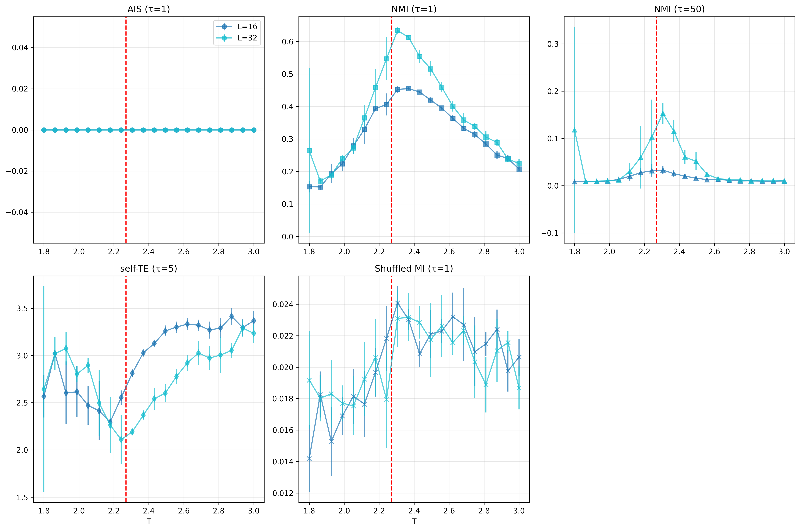

# Temporal Dynamics in Complex Systems: Information-Theoretic Analysis

## 项目概述

本项目实现了对复杂系统中临界性、混沌和计算网络的信息论分析框架。通过应用信息论方法（如传递熵、互信息等）来研究多种复杂系统的动力学特性。

## 核心系统分析

### 1. Echo State Networks (ESN) 临界性分析
- 分析ESN在临界状态下的信息传递特性
- 研究传递熵（Transfer Entropy）与系统性能的关系
- 支持不同临界点检测方法

### 2. 2D Ising 模型信息动力学
- 基于蒙特卡洛模拟的Ising模型分析
- 研究临界温度附近的信息传递和存储特性
- 实现多种信息论指标：传递熵、互信息等
- 支持不同的重参数化和温度扫描

### 3. Logistic Map 混沌系统分析
- 分析Logistic映射在混沌区域的动力学特性
- 研究信息在混沌系统中的传播和衰减
- 支持不同参数值和初始条件的分析

### 4. Sandpile 模型自组织临界性
- 分析Abelian Sandpile模型的自组织临界性
- 研究系统重置与信息传递的关系
- 探索临界雪崩的时空动力学

## 文件结构

```
temporal-dynamics/
├── src/                          # 源代码
│   ├── main.py                   # 主入口脚本
│   ├── ESN_criticality_te_fixed.py     # ESN临界性分析
│   ├── ising_ais_nmi_quick_revised.py  # Ising模型信息论分析
│   ├── logicMapTest_fixed.py     # Logistic映射分析
│   ├── sandpile_critical_time_analysis.py    # 沙堆模型分析
│   └── sandpile_reset_vs_te.py   # 沙堆重置分析
├── docs/                         # 文档
│   └── temporalDynamics.tex      # LaTeX论文
├── figures/                      # 结果图表
│   ├── ESN_criticality_te_sig.png      # ESN临界性结果
│   ├── TE_vs_Temperature_2D_Ising_full_plus.pdf  # Ising模型传递熵
│   ├── ising_info_dynamics_quick.png   # Ising信息动力学
│   ├── ising_nmi_ais_revised.png       # Ising模型NMI结果
│   ├── ising_shuffing_nmi_micro.png    # Ising洗牌分析
│   └── te_vs_reset_sandpile.pdf        # 沙堆传递熵结果
├── tests/                        # 测试文件
│   ├── __init__.py
│   └── test_basic.py
├── .github/                      # GitHub配置
│   ├── ISSUE_TEMPLATE/
│   │   └── bug_report.yml
│   └── workflows/
│       └── ci.yml
├── setup.py                      # 项目配置
├── requirements.txt              # 依赖包
├── LICENSE                       # 开源协议
└── README.md                     # 项目说明
```

## 安装指南

### 环境要求
- Python 3.8+
- 主要依赖包：
  - numpy >= 1.26.4
  - matplotlib >= 3.8.4
  - scipy >= 1.11.0
  - pandas >= 2.2.2

### 安装步骤
1. 克隆仓库：
   ```bash
   git clone https://github.com/wonderingWu/temporal-dynamics.git
   cd temporal-dynamics
   ```

2. 安装依赖：
   ```bash
   pip install -r requirements.txt
   ```

3. 安装JIDT (Java Information Dynamics Toolkit)：
   ```bash
   python download_jar.py
   ```

## 使用方法

### 快速开始
```bash
# 运行所有系统的分析
python src/main.py --all

# 运行特定系统的分析
python src/main.py --system esn      # ESN临界性分析
python src/main.py --system ising    # Ising模型分析
python src/main.py --system logistic # Logistic映射分析
python src/main.py --system sandpile # 沙堆模型分析
```

### 高级选项
```bash
# ESN分析示例
python src/main.py --system esn --nodes 100 --connectivity 0.1 --spectral_radius 0.9

# Ising模型分析示例
python src/main.py --system ising --size 32 --temperature 2.269 --steps 100000

# 沙堆模型分析示例
python src/main.py --system sandpile --size 64 --avalanches 1000
```

## 核心算法

### 1. 信息论分析
- **传递熵 (Transfer Entropy)**: 测量系统间的信息传递
- **互信息 (Mutual Information)**: 量化变量间的相关性
- **主动信息存储 (Active Information Storage)**: 评估系统的记忆特性

### 2. 临界性检测
- **有限尺度标度分析**: 确定临界参数
- **临界指数计算**: 量化相变的性质
- **有限时间标度**: 分析接近临界的动力学

### 3. 混沌系统分析
- **Lyapunov指数**: 量化混沌强度
- **信息维度**: 描述吸引子的几何性质
- **熵生成率**: 测量信息产生速率

## 主要结果

### ESN临界性

ESN在临界谱半径附近展现出最优的信息传递特性。

### Ising模型信息动力学

临界温度下Ising模型的信息传递和存储达到峰值。

### 沙堆模型自组织临界性

自组织临界系统中重置机制对信息传递的影响。

## 贡献

欢迎提交Issue和Pull Request来改进这个项目！

## 许可证

本项目采用MIT许可证 - 详见 [LICENSE](LICENSE) 文件。

## 引用

如果您在研究中使用了这个项目，请引用我们的论文：

```latex
\textbf{Code and data available at:} \url{https://github.com/wonderingWu/temporal-dynamics}
```

## 联系方式

- 项目主页: https://github.com/wonderingWu/temporal-dynamics
- 问题反馈: https://github.com/wonderingWu/temporal-dynamics/issues